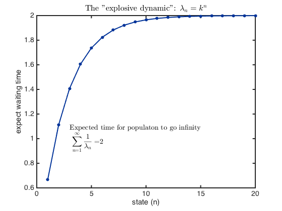
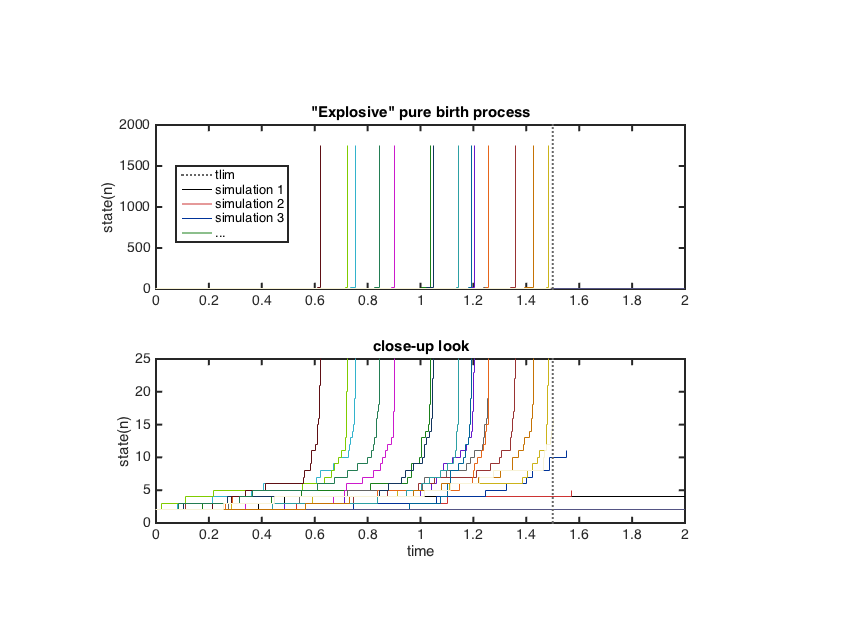

## Question 2: the demonstration
### The expected waiting time

In this exampl set _k = 1.5_, then the expected waiting time **converge** to _2_. This infact happen when population size (the state), _n_, is about _20_. In other words, when _n > 20_ the next event happen in no time and the population explode to infinity.

### Simulation
I implement Gillespie method to simulate this dynamic. 

With paramaters:

* tlim = 1.5
* X0 = 2

The population, once reach about n = 20, start to rise to infinity in no time. (in **matlab**, the growth rate (1.5^n) is defined as **inf** when n is about 1800.`)

### Appendices
* S2-1: The code for simulation and making plot
* S2-2: The Gillespie function: **explodGillespie.m**