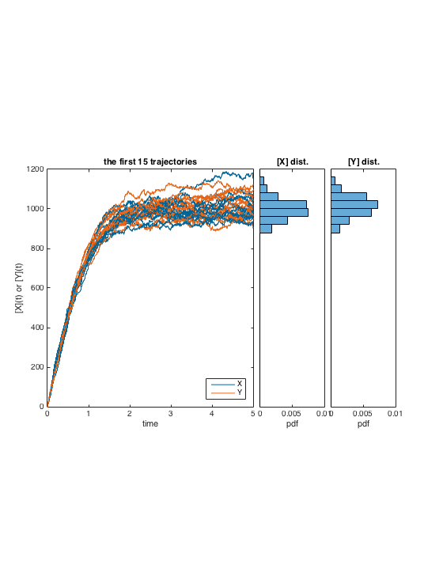
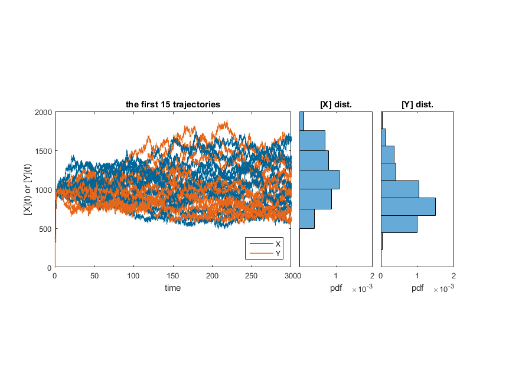

## Question 3: the demonstration
After some exploration, I found that the (quasi-) steaty state depend on the initial value (**Appendix S3-1**). 

### parameter set 1
Parameters:

* tlim = 500
* X0 = 0; Y0 = 0;

### parameter set 2
Parameters:

* tlim = 5
* X0 = 0; Y0 = 0;

#### parameter set 2 with longer simulation time
I also simulated the second (100 times faster) parameter set to 300 time steps. The resulting stationary is much more dispersed.

(Because the simulation took really long, I only did 100 iterations.)

### Synnopsis

 With the second parameter set, everything is 100 times faster, this is revealed in the speed (compare the time axis in the two graphs) of population trajectories. The two graphs are identical except for the time axis because I set the **seed** to identical number, and with the Gillespie algorism the second parameter will result in every **time to the next event** being 100 times longer. 

 If we fix the time simulated, the second parameter set results in a much more dispersed.  

### Appendices
* S3-1: The code and document for exploring steady state and initial values
* S3-2: The code for simulation and making plot
* S3-3: The Gillespie function: **chemGillespie.m**
