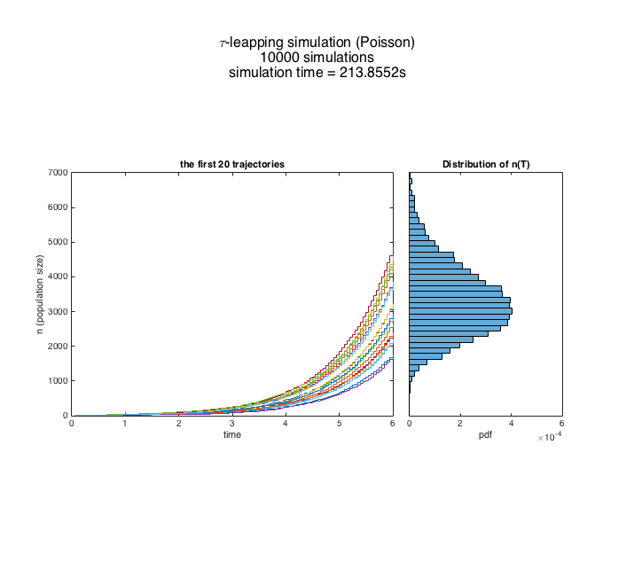
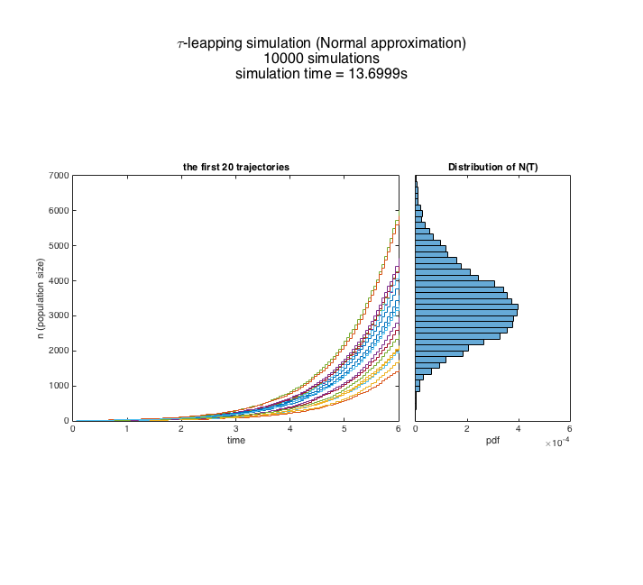

## Question 4: 
### The Yule process: simulate with tau-leaping 

In the Yule process, population growth rate is 
**lambda * n**. 

#### Model parameter
    lambda = 1;     % per capita birth rate
#### Simulation parameters
    n0 = 10         % initial value
    tau= 0.05;      % "tau"
    T = 6;          % total time
    points = T/tau; % # of time points in the simulation
#### Variable
    N =nan(1, points);     % state, population size
    it = 1000;             % iteration of simulation
    NendPois = nan(1, it); % end points of the Poisson simulation
    NendNorm = nan(1, it); % end points of the Normal 
    
### Using Possion approximation

     
     for p = 1: ( points - 1)
         n = N(  p ); % N at the begining of interval
         events = random( 'Poisson', tau * lambda * n ) ; 
         		% number of events
         N( p + 1 ) = n + events ;
     end
     
  
     
### Using Normal approximation
     
     for p = 1: ( points-1)
         n = N( p ); % N at the begining of interval
         rate = tau * lambda * n;
         events = randn * sqrt( rate ) + rate; % number of events
                          % std,         mean
         N(p+1) = n + events;                    
         % normal random variable could give unreasonable negative numbers           
         if  N(p+1) < 0
             N(p+1) =0;  % for convenience set this to 0
             flag = 0;   % this simulation will be excluded in the recorded sample
             % flag will be used later to determine whether to include this sample   
          end
       end

  

### Synopsis
 With the parameter setting, the Normal approximation gives trajectories very similar to the Poisson algorithm. In both cases, the stationary distribution of population sizes looks like bell-shaped distribution. 
 
 One major difference between the two algorithms is the time of simulation. The normal approximation ran about 15 times faster. 
  
  
### Appendices
* S4-1: The code for simulation and making plot
