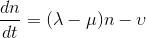
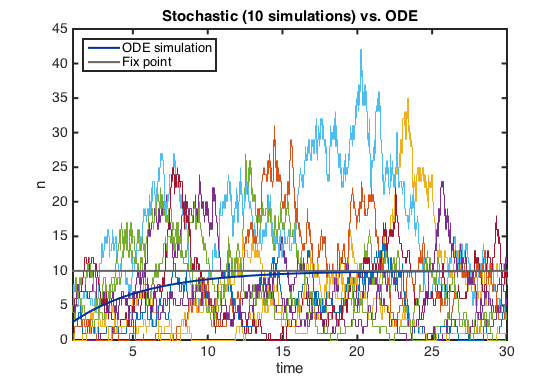
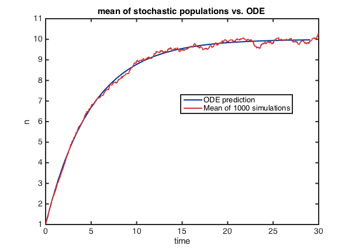
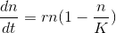
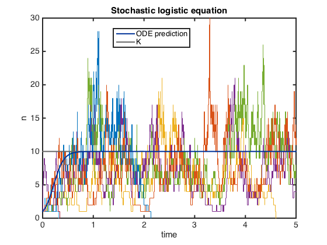
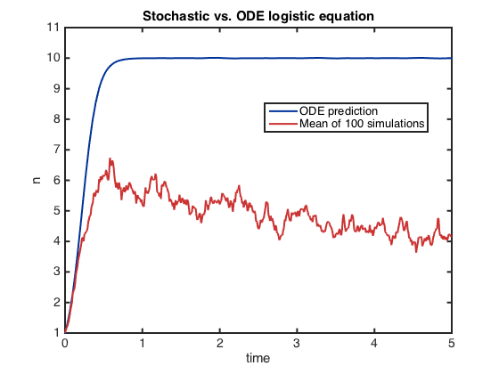

## Question 5:
  
### The Birth-Death-Immigration model 
  

#### parameters
    global rB   rD   Im
    	rB = 1;    % birth rate
    	rD = 1.2;  % death rate 
    	Im = 2;    % immigration flux
	% equilibrium, fix point:
    	n_fp = Im/(rD - rB);
	% simulation parameters
    	tlim = 30;
    	n0 = 1;
    	it = 1000; % interaction of simulation
    	
#### simulate ODE 
    rng(123); % set seed
    [t1, ns1] = ode45('BDIODE',[1 tlim],  1);
    % Figure
    	figure
    	myplot(t1-1, ns1, 'L'); hold on  
    	       % -1 so t starts at 0
    	hline(n_fp); % horizontal line
       xlabel('time');    
       ylabel('n');
       legend('ODE simulation','Fix point',...
              'Location','northwest')
       title('ODE of logistic equation') 
          
#### Plot some Gillespie simulations

	 rng(123)
	 for i=1:10
    	[t, x] = BDIGillespie(n0, tlim);
    	stairs(t,x); hold on
	 end
     % re-plot so they lay on top
    	myplot(t1-1, ns1, 'L'); hold on      		hline(n_fp);
    	xlim([1 tlim]);
     	xlabel('time');    
      	ylabel('n');
    	title('Stochastic (10 simulations) vs. ODE')	       
       
  

####  ODE vs. stochastic mean
The mean population trajectories of 1,000 simulations align well with the ODE prediction.

    tsample = 0 : 0.01 : tlim; 
    xsample = nan(it, length(tsample));
    rng(123)
    for i = 1 : it
        [t, x] = BDIGillespie(n0, tlim);
        xsample(i, :) =  fixsample(t,x, tsample);
    end
	% plot ODE vs. stochastic mean
    figure
        myplot(t1, ns1, 'L'); hold on
        myplot(tsample, mean(xsample), 'L', 2);
        legend('ODE prediction', ['Mean of ' num2str(it) ' simulations'])
        xlabel('time')
        ylabel('n')
        title('mean of stochastic populations vs. ODE ')

  
  
### General case
An example is the logistic equation; can be viewed as a special case of Birth-Death-Immigration process with immigration = 0. 

  

where r = b1 - d1,  K = r / (d2 - b2). 
  
I chose the parameters so the system has the same fix point as the first case.

#### parameters

 	 global b1 b2 d1 d2 r K
    	b1 = 11; b2 = 1;
    	d1 = 1;  d2 = 2;
    	r = b1 -d1;          % the intrinsic growth rate
    	K = r/(d2-b2);   % the carrying capacity; 
    		% also is the theoretical fixed point
    	tlim = 5;  
    	
#### ODE simulation
 	 
 	 rng(1)
    [t3, ns3] = ode45('logisticODE',[1 tlim+1],  n0);
    figure
        myplot(t3-1, ns3, 'L'); hold on
        hline(K); 
           	
#### Plot some Gillespie simulations
    
   	% simulation 
		for i=1:7
    		[t, x] = logisticGillespie(n0, tlim);
     		stairs(t, x); hold on  % -1 s
		end
	% plot3_2_3
      	hline(K);
      	myplot(t3-1, ns3, 'L'); % plot again so they are on top
       	ylimits = ylim;
       	axis([ 0  tlim ylimits])
       	legend('ODE prediction', 'K')
       	xlabel('time')
        	ylabel('n')
        	title('Stochastic logistic equation')
        	
       
  
#### ODE vs. stochastic mean

 	 tsample = 0 : 0.01 : tlim; 
    xsample = nan(it, length(tsample));
    	for i = 1 : it
            [t, x] = logisticGillespie(n0, tlim);
            xsample(i, :) =  fixsample(t,x, tsample);
            % fixsample is  the function I used to record 
            % population size at assigned time points
    	end
	% plot
     figure
        myplot(t3-1, ns3, 'L'); hold on
        myplot(tsample, mean(xsample), 'L', 2);
          legend('ODE prediction', ['Mean of ' num2str(it) ' simulations'])
          xlabel('time')
          ylabel('n')
          title('Stochastic vs. ODE logistic equation')
          
           
          
### Synopsis
In the first birth-death-immigration model, the mean population size of the stochastic simulations align really well with the ODE prediction, but in the logistic model the mean of simulated population is smaller. This is because in the logistic model, the mean stochastic population size was dragged own by the extinct populations.

In the birth-death-immigration with positive constance influx, extinct populations will soon be rescued by influx.  
  
### Appendices
* S5-1: ODE function for the Birth-death-immigration model
* S5-2: Gillespie function for the Birth-death-immigration model
* S5-3: ODE function for the logistic model
* S5-4: Gillespie function for the logistic model