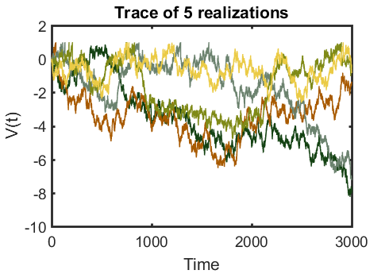
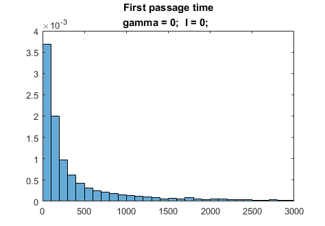
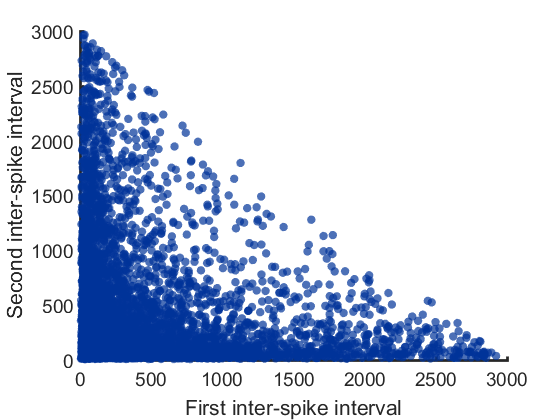
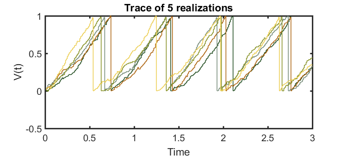
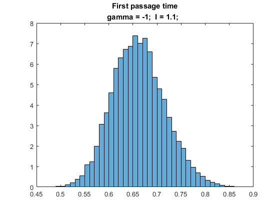
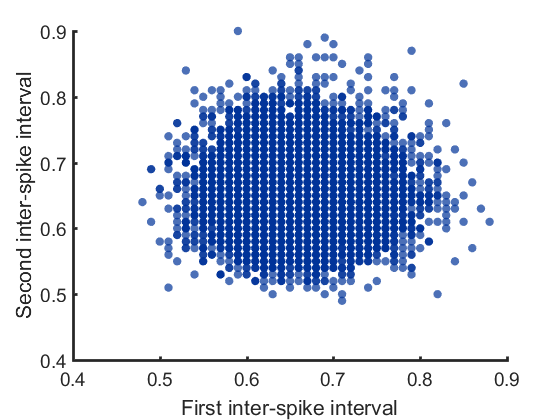

## Question 1:
  
### Scenario 1: gamma = 0, I(t) = 0     

This scenario left us only the Brownian movement part.
I set T = 3000 so about 70% of trials cross the threshold twice (with initial value V(0) = 0).

  

##### Histogram of first passage time

  

##### First vs. Second interval
Because this model is completely random walk, and the reset value is the same as the initial, the first and the second inter-spike interval should be uncorrelated. (the limit 3000 was set arbitrarily by the simulation time.)

  

  
### Scenario 2: gamma = -1, I(t) = 1.1     

This scenario we have constant influx, fixed ratio leaking and Brownian movement part. Because the Brownian part was relatively small (sigma = 0.1), the model should look much more like determined. And the first passage time should be more concentrated at some fixed value. 

  

##### Histogram of first passage timeS
Solving the deterministic part (see the page attached), the expected value for inter-spike interval is 0.6466. The simulation result is very close to this value.

  

##### First vs. Second interval
Because e reset value is the same as the initial, the first and the second inter-spike interval should be uncorrelated. 

  

## Code for LIF model

	function [V,t, s] =  LIFbpath(V0, sig, T,dt, smax)
		global Vreset Vthresh gamma I
               % use global to set parameters 
 		N = T/dt; 
 		dW = sqrt(dt) * randn(1, N);
 		W = cumsum(dW, 2);
 
		V = zeros(1, N);
 		s = nan(1, smax); % smax is the number of spikes to record
 		t = [dt:dt: T];
 		Vtemp = V0;
 		sc =1; % count of s
 		for i = 1: N
     		Vtemp = Vtemp + dt * (I - gamma*Vtemp) +sig *dW(i);
     		if Vtemp >= Vthresh  % spike
           		Vtemp = Vreset;
           		if sc <= smax 
                	s(sc) = t(i); % record a spike
                	sc = sc+1;
           		end
     		end
     		V(i) = Vtemp;
	 	end
