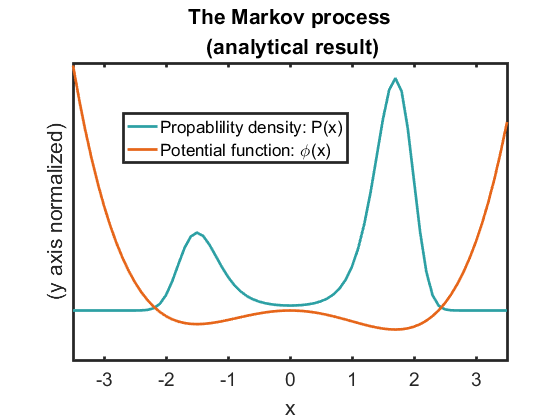
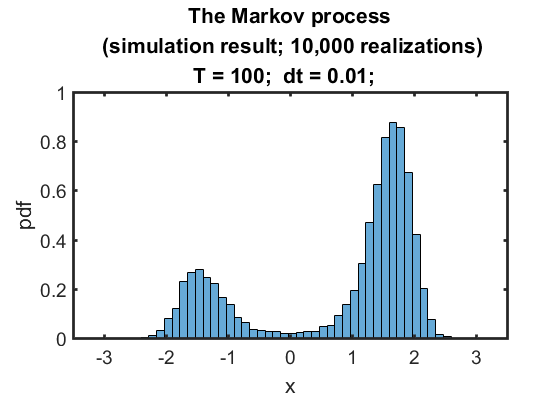

## Question 2:

#### Analytical result
I plotted the analytical result of the potential function and probability density on the same graph. (The Y axis should be rescaled that the sum of P(x) be 1.)

	x = [-3.5 :0.1 : 3.5];
	B = 1;  k=1;
	phi = 0.5 * (x .^ 4) - 0.4 /3* (x .^ 3) - 5.1/2* (x .^ 2);
	P = (k/B) .* exp(-1* phi);

	myplot(x, P, 'L', 15); hold on
	myplot(x, phi, 'L', 13); 
		xlim([ -3.5 3.5])
	legend('Propablility density: P(x)', 'Potential function: \phi(x)')
	xlabel('x');
	ylabel('(y axis normalized)');
	title({'The Markov process',' (analytical result)'})
	set(gca, 'Ytick', '')

Potential and probability density

  

#### simulation
I simulated the process with Eular-Maruyama method:

		T = 100;
		dt = 0.01;
		it = 10000; 
		X0 = 1;
		ss = zeros(it, 1);
	for i = 1 : it
  		[X, t] =  MarkovEM(X0, T, dt);
        ss(i) = X(end);
	end

With T = 100, the distribution is already quite similar to the theoretical prediction.

	figure
 		histogram(ss, 40, 'normalization', 'pdf')
      	set(gca,'FontSize',14,'linewidth',2);  
 		xlabel('x');
 		ylabel('pdf');

  

#### The model: `MarkovEM`
	function [X, t] =  MarkovEM(X0, T, dt)
    	N = T/dt;
    	dW = sqrt(dt) * randn(1, N);
    	W = cumsum(dW, 2);
    	X = zeros( 1, N ) ;
    	t = [ dt : dt : T ];    
     	Xt = X0;     

 		for i = 1: N
     		Xt = Xt + dt *(-1)* Xt*(Xt + 1.5)*(Xt -1.7)  + 1 *dW(i);    
     		X(i) = Xt;
 		end