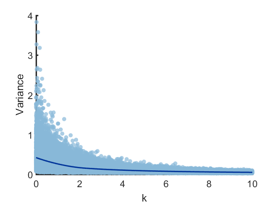
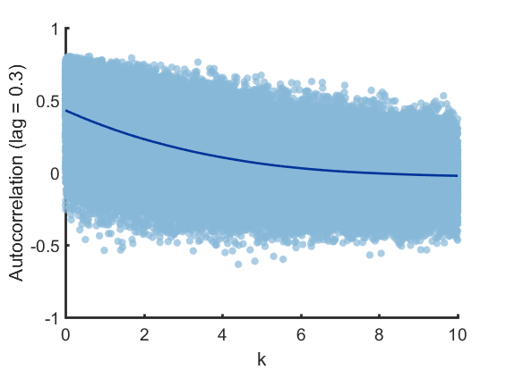

## Question 4:

### simulation parameter
	T = 3;
	dt = 0.01;
	X0 = 0;
	global k D
		k = 0;
		D = 1;
	ksim = [0: 0.01:10]; % simulated range of k
	it = 100; % for each k value, simulate it time
    lag = 30; % The lag of autocorrelation would be lag * dt

I ran the simulation across a gradient of k values (10 ~ 0) at every 0.01 interval, and repeated 100 times at each value. For each simulation record the variance and auto-correlation.

	for j = 1: it
        for i = 1 : length(ksim)
                k = ksim(i);
                [X, t] =  OU_EM(X0, T, dt);
                Varx(j, i) = var(X);          
                    [r] =autocorr(X, lag);
                ARx(j, i) = r(lag+1);
        end
	end

### Variance

The variance of population increased at about k=2.

  

### Auto-correlation

The auto-correlation shows critical increase at about k=4. (The result can be sensitive to the amount of lag, with lag too small, the relationship between k and autocorrelation would look linear.)

  

### Ornstein-Uhlenbeck model : 	`OU_EM.m`
	function [X, t] =  OU_EM(X0, T, dt)
		global k D
    	N = T/dt;
    	dW = sqrt(dt) * randn(1, N);
    	W = cumsum(dW, 2);
    	X = zeros( 1, N ) ;
    	t = [ dt : dt : T ];    
     	Xt = X0;     

 		for i = 1: N
     		Xt = Xt + dt *k * Xt + sqrt(D) *dW(i);  
     		X(i) = Xt;
 		end